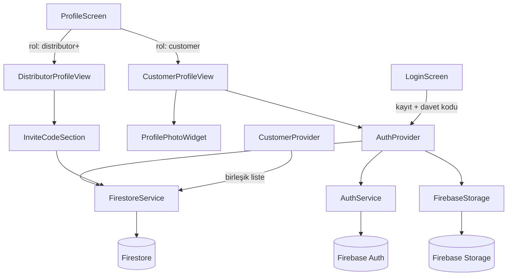

# Tasarım Belgesi: Müşteri Profil Ayarları

## Genel Bakış

Bu özellik, HerbaFormix Flutter uygulamasındaki profil ekranını müşteri rolüne özgü kapsamlı bir profil yönetim deneyimine dönüştürür. Mevcut `ProfileScreen` yalnızca distribütör alanlarını (ad-soyad, distribütör seviyesi, VP hedefi) barındırmaktadır. Bu tasarım; kişisel bilgiler, sağlık verileri, profil fotoğrafı, şifre değiştirme ve çıkış işlevlerini müşteri rolüne eklerken, distribütör-müşteri bağlantısını otomatikleştiren davet kodu sistemini de hayata geçirir.

Proje; Flutter + Firebase (Firestore, Auth, Storage), Provider state management, go_router ve feature-based klasör yapısı kullanmaktadır.

---

## Mimari

### Genel Akış



### Katman Sorumlulukları

| Katman | Sınıf | Sorumluluk |
|--------|-------|------------|
| UI | `ProfileScreen` | Rol bazlı koşullu render |
| UI | `CustomerProfileView` | Müşteri profil formu (kişisel + sağlık) |
| UI | `DistributorProfileView` | Distribütör profil formu + davet kodu |
| UI | `ChangePasswordDialog` | Şifre değiştirme diyalogu |
| UI | `ProfilePhotoWidget` | Fotoğraf seçme/gösterme widget'ı |
| State | `AuthProvider` | Auth + profil state yönetimi |
| State | `CustomerProvider` | Birleşik müşteri listesi |
| Service | `FirestoreService` | Firestore CRUD + davet kodu işlemleri |
| Service | `AuthService` | Firebase Auth işlemleri |
| Model | `UserProfileModel` | Kullanıcı profil veri modeli |
| Model | `InviteCodeModel` | Davet kodu veri modeli |

---

## Bileşenler ve Arayüzler

### 1. UserProfileModel (Genişletilmiş)

`lib/models/user_profile_model.dart` dosyasına aşağıdaki alanlar eklenir:

```dart
// Yeni alanlar
DateTime? birthDate;
String? gender;           // "Kadın" | "Erkek" | "Belirtmek İstemiyorum"
String? healthNotes;      // max 1000 karakter
String? allergies;        // max 1000 karakter
String? medications;      // max 1000 karakter
String? assignedDistributorId;
String? profilePhotoUrl;
```

`toMap()` davranışı: null olan opsiyonel alanlar map'e dahil edilmez (`if (field != null) map['key'] = value` pattern'i).

`fromMap()` davranışı: `birthDate` için `int` → `DateTime` dönüşümü; beklenmedik tür gelirse `null` atanır.

### 2. InviteCodeModel (Yeni)

`lib/models/invite_code_model.dart` dosyası oluşturulur:

```dart
class InviteCodeModel {
  final String id;           // Firestore doküman ID
  final String code;         // 8 karakterlik büyük harf+rakam
  final String distributorId;
  final DateTime createdAt;
  final bool isUsed;
  final String? usedByUserId;
}
```

### 3. AuthProvider (Genişletilmiş)

`lib/features/auth/providers/auth_provider.dart` dosyasına eklenen metodlar:

```dart
// Şifre değiştirme
Future<void> changePassword({
  required String currentPassword,
  required String newPassword,
}) async { ... }

// Profil fotoğrafı yükleme
Future<String?> uploadProfilePhoto(File imageFile) async { ... }

// Davet koduyla kayıt
Future<bool> signUpWithInviteCode({
  required String email,
  required String password,
  required UserRole role,
  String? inviteCode,
}) async { ... }
```

`changePassword` akışı:
1. `reauthenticateWithCredential(EmailAuthProvider.credential(email, currentPassword))`
2. `updatePassword(newPassword)`
3. Hata durumunda `FirebaseAuthException.code` değerine göre anlamlı hata mesajı fırlatır.

`uploadProfilePhoto` akışı:
1. `FirebaseStorage.instance.ref('users/{uid}/profile.jpg').putFile(imageFile)`
2. `getDownloadURL()` ile URL döner.
3. Hata durumunda `null` döner (profil kaydı fotoğraf hatasıyla iptal edilmez).

### 4. FirestoreService (Genişletilmiş)

`lib/services/firestore_service.dart` dosyasına eklenen metodlar:

```dart
// Davet kodu oluşturma
Future<InviteCodeModel> createInviteCode(String distributorId) async { ... }

// Davet kodu doğrulama
Future<InviteCodeModel?> validateInviteCode(String code) async { ... }

// Davet koduyla atomik kayıt (batch write)
Future<void> signUpWithInviteCodeBatch({
  required UserProfileModel userProfile,
  required String inviteCodeId,
  required String newUserId,
}) async { ... }

// Distribütör profilini getir
Future<UserProfileModel?> getDistributorProfile(String distributorId) async { ... }

// Distribütöre bağlı userProfiles müşterilerini getir
Stream<List<UserProfileModel>> getCustomersByDistributorId(String distributorId) { ... }
```

`createInviteCode` akışı:
1. `_generateUniqueCode()` ile 8 karakterlik kod üret.
2. `inviteCodes` koleksiyonunda kod çakışması kontrolü yap.
3. Çakışma varsa yeni kod üret (maksimum 5 deneme).
4. `InviteCodeModel` dokümanını Firestore'a yaz.

`signUpWithInviteCodeBatch` akışı:
1. `WriteBatch` oluştur.
2. `userProfiles/{uid}` dokümanını batch'e ekle.
3. `inviteCodes/{codeId}` dokümanını `isUsed: true, usedByUserId: uid` ile batch'e ekle.
4. `batch.commit()` — atomik yazma.

### 5. CustomerProvider (Genişletilmiş)

`lib/features/customers/providers/customer_provider.dart` dosyasına eklenen metod:

```dart
// Birleşik müşteri listesi (alt koleksiyon + userProfiles)
Future<List<CombinedCustomerEntry>> getCombinedCustomers() async { ... }
```

`getCombinedCustomers` akışı:
1. `users/{uid}/customers` alt koleksiyonundan `CustomerModel` listesi çek.
2. `userProfiles` koleksiyonundan `assignedDistributorId == uid` olan profilleri çek.
3. Her iki listeyi birleştir; `userProfiles` kaynağını önceliklendir.
4. Aynı kullanıcı her iki kaynakta da varsa yalnızca bir kez göster (deduplicate by UID/email).

### 6. ProfileScreen (Refactor)

`lib/features/profile/screens/profile_screen.dart` dosyası rol bazlı koşullu render ile yeniden yapılandırılır:

```dart
@override
Widget build(BuildContext context) {
  final role = authProvider.userProfile?.role;
  return Scaffold(
    appBar: AppBar(title: const Text('Profilim')),
    body: role == UserRole.customer
        ? const CustomerProfileView()
        : const DistributorProfileView(),
  );
}
```

### 7. CustomerProfileView (Yeni Widget)

`lib/features/profile/widgets/customer_profile_view.dart` dosyası oluşturulur. Bölümler:

- **Profil Fotoğrafı**: `ProfilePhotoWidget`
- **Kişisel Bilgiler**: ad-soyad (zorunlu), e-posta (salt okunur), telefon (E.164), doğum tarihi (DatePicker), cinsiyet (Dropdown)
- **Sağlık Bilgileri**: boy (50-300 cm), mevcut kilo (10-500 kg), hedef kilo (10-500 kg), sağlık notları, alerjiler, ilaçlar (her biri max 1000 karakter)
- **Distribütör Bilgisi**: `DistributorInfoCard` (salt okunur)
- **Eylemler**: Kaydet, Şifre Değiştir, Çıkış Yap

### 8. ProfilePhotoWidget (Yeni Widget)

`lib/features/profile/widgets/profile_photo_widget.dart` dosyası oluşturulur:

```dart
class ProfilePhotoWidget extends StatelessWidget {
  final String? photoUrl;
  final File? localFile;       // Seçilmiş ama henüz yüklenmemiş
  final bool isUploading;
  final VoidCallback onTap;
}
```

Dokunulduğunda `BottomSheet` açar: "Kameradan Çek" / "Galeriden Seç".

### 9. DistributorInfoCard (Yeni Widget)

`lib/features/profile/widgets/distributor_info_card.dart` dosyası oluşturulur. `assignedDistributorId` varsa distribütör adı ve telefonu gösterir; yoksa bilgi mesajı gösterir.

### 10. ChangePasswordDialog (Yeni Widget)

`lib/features/profile/widgets/change_password_dialog.dart` dosyası oluşturulur. Mevcut şifre, yeni şifre, yeni şifre tekrarı alanlarını içerir.

### 11. InviteCodeSection (Yeni Widget)

`lib/features/profile/widgets/invite_code_section.dart` dosyası oluşturulur. Distribütör profil ekranında davet kodu oluşturma ve listeleme bölümü.

---

## Veri Modelleri

### Firestore Koleksiyon Yapısı

```
userProfiles/
  {uid}/
    email: string
    role: string
    name: string?
    phoneNumber: string?          // E.164 formatı
    birthDate: int?               // millisecondsSinceEpoch
    gender: string?               // "Kadın" | "Erkek" | "Belirtmek İstemiyorum"
    healthNotes: string?          // max 1000 karakter
    allergies: string?            // max 1000 karakter
    medications: string?          // max 1000 karakter
    assignedDistributorId: string?
    profilePhotoUrl: string?
    height: double?               // cm, 50-300
    weight: double?               // kg, 10-500
    goal: string?                 // hedef kilo (kg)
    distributorLevel: string?
    monthlyVPTarget: int?
    isOnboarded: bool
    ...

inviteCodes/
  {codeId}/
    code: string                  // 8 karakter, [A-Z0-9]
    distributorId: string         // distribütör UID
    createdAt: Timestamp
    isUsed: bool
    usedByUserId: string?
```

### Firebase Storage Yapısı

```
users/
  {uid}/
    profile.jpg                   // Profil fotoğrafı (JPEG/PNG/HEIC → JPEG olarak saklanır)
```

### UserProfileModel Tam Alanlar

```dart
class UserProfileModel {
  // Mevcut alanlar (değişmez)
  final String id;
  final String email;
  final UserRole role;
  String? name;
  String? distributorLevel;
  int? monthlyVPTarget;
  bool isOnboarded;
  int? age;
  String? phoneNumber;
  double? weight;
  double? height;
  String? goal;
  DateTime? programStartDate;
  String? userGoal;
  String? wakeTime;
  String? lunchTime;
  String? sleepTime;

  // Yeni alanlar (bu özellikle eklenir)
  DateTime? birthDate;
  String? gender;
  String? healthNotes;
  String? allergies;
  String? medications;
  String? assignedDistributorId;
  String? profilePhotoUrl;
}
```

### InviteCodeModel

```dart
class InviteCodeModel {
  final String id;
  final String code;
  final String distributorId;
  final DateTime createdAt;
  final bool isUsed;
  final String? usedByUserId;

  factory InviteCodeModel.fromMap(Map<String, dynamic> map, String id) { ... }
  Map<String, dynamic> toMap() { ... }
}
```

---

## Doğruluk Özellikleri

*Bir özellik (property), bir sistemin tüm geçerli çalışmalarında doğru olması gereken bir karakteristik veya davranıştır — temelde sistemin ne yapması gerektiğine dair biçimsel bir ifadedir. Özellikler, insan tarafından okunabilir spesifikasyonlar ile makine tarafından doğrulanabilir doğruluk garantileri arasındaki köprüyü oluşturur.*

### Özellik 1: UserProfileModel Serializasyon Round-Trip

*Herhangi bir* geçerli `UserProfileModel` örneği için, `toMap()` ardından `fromMap()` çağrıldığında elde edilen model, orijinal modelle eşdeğer olmalıdır. Bu özellik; `birthDate` (int ↔ DateTime), `gender`, `healthNotes`, `allergies`, `medications`, `assignedDistributorId` ve `profilePhotoUrl` alanlarının tüm kombinasyonlarını kapsar.

**Doğrular: Gereksinim 1.2, 1.3, 1.4, 1.5**

### Özellik 2: toMap() Null Alanları Dışlar

*Herhangi bir* `UserProfileModel` örneği için, `toMap()` çağrıldığında dönen map'te `null` değerli opsiyonel alanların anahtarları bulunmamalıdır.

**Doğrular: Gereksinim 1.2**

### Özellik 3: Ad-Soyad Whitespace Validasyonu

*Yalnızca boşluk karakterlerinden oluşan herhangi bir* string (boş string dahil) ad-soyad alanına girildiğinde, form validasyonu başarısız olmalı ve kayıt işlemi engellenmelidir.

**Doğrular: Gereksinim 2.5**

### Özellik 4: Telefon E.164 Format Validasyonu

*E.164 formatına uymayan herhangi bir* dolu telefon numarası string'i için (ülke kodu dahil 7-15 rakam kuralını ihlal eden), form validasyonu başarısız olmalıdır.

**Doğrular: Gereksinim 2.6**

### Özellik 5: Boy Aralık Validasyonu

*50 cm'den küçük veya 300 cm'den büyük herhangi bir* boy değeri için form validasyonu başarısız olmalı; [50, 300] aralığındaki herhangi bir değer için başarılı olmalıdır.

**Doğrular: Gereksinim 3.2, 3.5**

### Özellik 6: Kilo Aralık Validasyonu

*10 kg'dan küçük veya 500 kg'dan büyük herhangi bir* kilo değeri için form validasyonu başarısız olmalı; [10, 500] aralığındaki herhangi bir değer için başarılı olmalıdır. Bu özellik hem mevcut kilo hem de hedef kilo alanları için geçerlidir.

**Doğrular: Gereksinim 3.3, 3.5**

### Özellik 7: Sağlık Alanları Karakter Sınırı Validasyonu

*1000 karakterden uzun herhangi bir* string için sağlık notları, alerjiler veya ilaçlar alanlarının validasyonu başarısız olmalıdır.

**Doğrular: Gereksinim 3.7**

### Özellik 8: Davet Kodu Format Garantisi

*Herhangi bir* `createInviteCode` çağrısında üretilen kod tam olarak 8 karakter uzunluğunda olmalı ve yalnızca büyük harf (`A-Z`) ile rakam (`0-9`) karakterlerinden oluşmalıdır.

**Doğrular: Gereksinim 9.2**

### Özellik 9: Müşteri Listesi Deduplicate

*Herhangi bir* alt koleksiyon müşteri listesi ve `userProfiles` müşteri listesi kombinasyonu için, `getCombinedCustomers()` sonucunda her müşteri yalnızca bir kez yer almalıdır.

**Doğrular: Gereksinim 11.1, 11.4**

---

## Hata Yönetimi

### Firebase Auth Hataları

| Hata Kodu | Durum | Kullanıcıya Gösterilen Mesaj |
|-----------|-------|------------------------------|
| `wrong-password` | Şifre değiştirme — mevcut şifre yanlış | "Mevcut şifreniz hatalı." |
| `requires-recent-login` | Yeniden kimlik doğrulama gerekli | "Güvenlik nedeniyle lütfen tekrar giriş yapın." |
| `weak-password` | Yeni şifre çok zayıf | "Şifre en az 6 karakter olmalıdır." |
| `network-request-failed` | Ağ hatası | "İnternet bağlantınızı kontrol edin." |

### Firebase Storage Hataları

- Yükleme başarısız olursa: `uploadProfilePhoto` `null` döner, profil kaydı fotoğraf hatası nedeniyle iptal edilmez.
- Ağdan fotoğraf yüklenemezse: `ProfilePhotoWidget` varsayılan placeholder avatar gösterir.
- Dosya boyutu 10 MB'ı aşarsa: Yükleme başlatılmadan önce istemci tarafında kontrol edilir, hata mesajı gösterilir.
- Desteklenmeyen format: `image_picker` ile seçim sırasında JPEG/PNG/HEIC dışı dosyalar filtrelenir.

### Firestore Hataları

- `getUserProfile` başarısız olursa: `AuthProvider` `_userProfile = null` bırakır, ekran yükleniyor durumunda kalır.
- `setUserProfile` başarısız olursa: `AuthProvider.updateUserProfile` `false` döner, ekran hata SnackBar gösterir.
- `getDistributorProfile` başarısız olursa: `DistributorInfoCard` "Distribütör bilgisi yüklenemedi." mesajı gösterir.
- Batch write başarısız olursa: Tüm işlem geri alınır (Firestore batch atomikliği), kullanıcıya hata bildirilir.

### Davet Kodu Hataları

| Durum | Davranış |
|-------|----------|
| Kod bulunamadı | Kayıt engellenir, "Geçersiz davet kodu." mesajı |
| Kod kullanılmış (`isUsed: true`) | Kayıt engellenir, "Bu davet kodu daha önce kullanılmış." mesajı |
| Kod üretiminde çakışma | Maksimum 5 deneme; başarısız olursa hata fırlatılır |
| Batch write kısmi başarısızlık | Firestore atomikliği sayesinde rollback garantili |

---

## Test Stratejisi

### Birim Testleri

**`UserProfileModel` testleri** (`test/models/user_profile_model_test.dart`):
- Tüm yeni alanlarla `fromMap()` / `toMap()` round-trip
- `null` alanların `toMap()` çıktısında yer almadığı
- Bozuk `birthDate` tipiyle `fromMap()` çağrıldığında `null` dönmesi
- Geçerli ve geçersiz `birthDate` int değerleriyle dönüşüm

**`InviteCodeModel` testleri** (`test/models/invite_code_model_test.dart`):
- `fromMap()` / `toMap()` round-trip
- `isUsed` ve `usedByUserId` alanlarının doğru dönüşümü

**Form validasyon testleri** (`test/features/profile/validation_test.dart`):
- Ad-soyad whitespace validasyonu
- E.164 telefon format validasyonu
- Boy/kilo aralık validasyonu
- Sağlık alanları karakter sınırı validasyonu

**`FirestoreService` davet kodu testleri** (`test/services/firestore_service_invite_test.dart`):
- `_generateCode()` fonksiyonunun 8 karakter ve [A-Z0-9] ürettiği
- `validateInviteCode` geçerli/geçersiz/kullanılmış kod senaryoları

**`CustomerProvider` deduplicate testleri** (`test/features/customers/customer_provider_test.dart`):
- Çakışan ID'lerle iki liste birleştirildiğinde tekrarsız sonuç
- `userProfiles` kaynağının önceliklendirilmesi

### Özellik Tabanlı Testler (Property-Based Tests)

Proje Dart kullandığından **`package:test`** ile birlikte **`package:glados`** kullanılır (Dart ekosisteminde property-based testing için aktif olarak geliştirilen paket).

Her özellik testi minimum **100 iterasyon** çalıştırılır.

**`test/models/user_profile_model_pbt_test.dart`**:

```dart
// Özellik 1: Serializasyon Round-Trip
// Feature: customer-profile-settings, Property 1: UserProfileModel serializasyon round-trip
test('toMap() → fromMap() round-trip eşdeğerliği', () {
  // Rastgele UserProfileModel üret (tüm alan kombinasyonları)
  // toMap() çağır → fromMap() çağır → eşdeğerliği doğrula
  // Min 100 iterasyon
});

// Özellik 2: toMap() Null Alanları Dışlar
// Feature: customer-profile-settings, Property 2: toMap() null alanları dışlar
test('null opsiyonel alanlar toMap() çıktısında yer almaz', () {
  // Rastgele null/non-null alan kombinasyonlarıyla model üret
  // toMap() çağır → null değerli anahtarların olmadığını doğrula
});
```

**`test/features/profile/validation_pbt_test.dart`**:

```dart
// Özellik 3: Ad-Soyad Whitespace Validasyonu
// Feature: customer-profile-settings, Property 3: whitespace ad-soyad validasyonu
test('yalnızca whitespace içeren ad-soyad reddedilir', () {
  // Rastgele whitespace string'leri üret (' ', '\t', '\n' kombinasyonları)
  // validateName() çağır → false döndüğünü doğrula
});

// Özellik 4: Telefon E.164 Validasyonu
// Feature: customer-profile-settings, Property 4: E.164 format validasyonu
test('E.164 formatına uymayan telefon numaraları reddedilir', () {
  // Geçersiz format string'leri üret
  // validatePhone() çağır → false döndüğünü doğrula
});

// Özellik 5: Boy Aralık Validasyonu
// Feature: customer-profile-settings, Property 5: boy aralık validasyonu
test('aralık dışı boy değerleri reddedilir', () {
  // 50'den küçük ve 300'den büyük rastgele değerler üret
  // validateHeight() çağır → false döndüğünü doğrula
});

// Özellik 6: Kilo Aralık Validasyonu
// Feature: customer-profile-settings, Property 6: kilo aralık validasyonu
test('aralık dışı kilo değerleri reddedilir', () {
  // 10'dan küçük ve 500'den büyük rastgele değerler üret
  // validateWeight() çağır → false döndüğünü doğrula
});

// Özellik 7: Sağlık Alanları Karakter Sınırı
// Feature: customer-profile-settings, Property 7: sağlık alanları karakter sınırı
test('1000 karakterden uzun sağlık alanları reddedilir', () {
  // 1001+ karakter uzunluğunda rastgele string'ler üret
  // validateHealthField() çağır → false döndüğünü doğrula
});
```

**`test/services/invite_code_pbt_test.dart`**:

```dart
// Özellik 8: Davet Kodu Format Garantisi
// Feature: customer-profile-settings, Property 8: davet kodu format garantisi
test('üretilen davet kodu 8 karakter ve [A-Z0-9] içerir', () {
  // _generateCode() fonksiyonunu 100+ kez çağır
  // Her seferinde uzunluk == 8 ve RegExp(r'^[A-Z0-9]{8}$').hasMatch(code) doğrula
});
```

**`test/features/customers/customer_provider_pbt_test.dart`**:

```dart
// Özellik 9: Müşteri Listesi Deduplicate
// Feature: customer-profile-settings, Property 9: müşteri listesi deduplicate
test('birleşik müşteri listesinde tekrar yoktur', () {
  // Rastgele iki müşteri listesi üret (bazı ortak ID'lerle)
  // mergeAndDeduplicate() çağır → ID'lerin unique olduğunu doğrula
});
```

### Entegrasyon Testleri

- **Batch write atomikliği**: Davet kodu kullanımı + profil oluşturma batch işleminin kısmi başarısızlık durumunda rollback yaptığı (Firebase Emulator ile).
- **Firebase Storage yükleme**: Gerçek dosya yükleme ve URL alma akışı (Firebase Emulator ile).
- **Firestore güvenlik kuralları**: Her kural için pozitif ve negatif test senaryoları.

### Paket Bağımlılıkları

```yaml
dependencies:
  image_picker: ^1.1.2
  firebase_storage: ^12.3.7

dev_dependencies:
  glados: ^0.5.0   # Property-based testing for Dart
```
