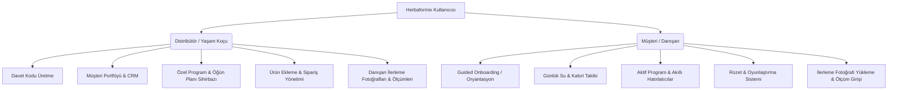

# HERBAFORMIX — ÜRÜN GEREKSİNİMLERİ DÖKÜMANI (PRODUCT REQUIREMENT DOCUMENT - PRD)

Bu döküman, **Herbaformix** sağlıklı yaşam ve beslenme takip platformunun ürün vizyonunu, fonksiyonel gereksinimlerini, teknik mimarisini, veri tabanı şemasını ve tasarım standartlarını kapsamlı bir şekilde tanımlar.

---

## 📝 PROJE KÜNYESİ
* **Proje Adı:** Herbaformix
* **Sürüm:** v1.0.0 (Temel Sürüm)
* **Hedef Kitle:** Bağımsız Distribütörler (Yaşam Koçları) ve Onların Kayıtlı Müşterileri (Danışanlar)
* **Geliştirme Platformu:** Flutter (Android, iOS ve Web)
* **Veri Tabanı ve Altyapı:** Firebase (Auth, Firestore, Cloud Storage, Hosting)
* **Lokalizasyon Dil:** Türkçe (`tr_TR`)

---

## 🌐 1. PROJE ÖZETİ VE VİZYONU
Herbaformix, sağlıklı beslenme ve aktif yaşam tarzını benimseyen bireyler ile onlara rehberlik eden yaşam koçlarını (Distribütörleri) bir araya getiren mobil öncelikli bir ekosistemdir. 

Uygulama iki temel sorunu çözer:
1. **Danışanlar (Müşteriler):** Günlük su tüketimlerini, öğünlerini, Herbalife ürün kullanımlarını ve kilo değişimlerini disiplinli bir şekilde takip etmekte zorlanırlar.
2. **Yaşam Koçları (Distribütörler):** Danışanlarının günlük rutinlerini, beslenme planlarını ve fiziksel gelişimlerini (ölçüler, fotoğraflar) tek tek WhatsApp veya Excel üzerinden takip etmekte zorlanırlar.

**Vizyon:** Danışanların kendi kişisel hedeflerine ulaşırken eğlenceli ve oyunlaştırılmış bir arayüzle rutinlerini takip edebildiği; yaşam koçlarının ise tüm müşteri portföyünü, siparişleri, ölçümleri ve programları tek bir CRM panelinden profesyonelce yönetebildiği hepsi bir arada (All-in-One) bir platform oluşturmaktır.

---

## 👥 2. KULLANICI ROLLERİ VE YETKİ AĞACI

Uygulamada rol tabanlı erişim kontrolü (RBAC) uygulanır. `UserRole` enumu altında iki ana rol tanımlanmıştır:



### 2.1. Distribütör (Distribütör / Yaşam Koçu)
* **Müşteri Davet Sistemi:** Benzersiz davet kodları (`InviteCodeModel`) oluşturarak yeni müşterilerin kendi hesaplarına otomatik bağlanmasını sağlar.
* **CRM & Müşteri Listesi:** Aktif danışanlarının listesini görür, detaylı aramalar yapabilir ve filtreler uygulayabilir.
* **Akıllı Program Hazırlama:** Her bir müşterinin hedefine özel program sihirbazını kullanarak öğün planı (öğün saatleri, normal yemek veya shake/çay/aloe gibi ürünlerin kombinasyonu) tanımlar.
* **Gelişim İzleme:** Müşterilerin girdiği kilo, bel, kalça vb. ölçümleri grafiksel olarak inceler ve yüklenen gelişim fotoğraflarını takip eder.
* **Sipariş Yönetimi:** Müşteriler adına sipariş oluşturur veya müşterilerin ürün isteklerini takip eder.

### 2.2. Müşteri (Danışan)
* **Kişiselleştirilmiş Oryantasyon:** Sisteme ilk girdiğinde uyku, uyanma, öğle yemeği saatlerini ve sağlık hedeflerini belirten sihirbazı tamamlar.
* **Rutin Takipçisi:** Koçu tarafından kendisine atanan beslenme ve ürün programını saat bazlı görür. Her adımı "tamamlandı" olarak işaretler.
* **Su & Kalori Takibi:** Günlük su tüketim hedefine ulaşmak için hızlı ekleme butonlarını (+250ml, +500ml) kullanır; yediği besinlerin kalorilerini kaydeder.
* **Oyunlaştırma:** Belirli hedeflere ulaştıkça (örneğin 7 gün üst üste su hedefini tamamlama) dijital rozetler kazanır.
* **Fotoğraflı ve Ölçülü Gelişim Günlüğü:** Kendi kilo ve ölçümlerini girer, gelişim fotoğraflarını sisteme yükleyerek zamana yayılmış değişimini gözlemler.

---

## 🚀 3. FONKSİYONEL GEREKSİNİMLER

### 3.1. Üyelik, Giriş ve Davet Yönetimi
* **Giriş Yöntemleri:** Google Sign-In ve E-posta/Şifre ile entegre Firebase Authentication.
* **Distribütör-Müşteri Bağlantısı:** 
  * Distribütör, sistemde 8 haneli alfanümerik benzersiz bir davet kodu üretir (Örn: `A3BX9K2M`). Bu kod WhatsApp üzerinden doğrudan danışana gönderilebilir.
  * Danışan uygulamaya kaydolurken bu davet kodunu girer.
  * Sistem otomatik olarak danışanı bu distribütörün altına kaydeder (`assignedDistributorId`).
  * Davet kodlarının geçerlilik süresi varsayılan olarak **7 gündür**. Süresi dolan veya kullanılan kodlar pasif duruma geçer.

### 3.2. Müşteri Oryantasyonu (Customer Onboarding)
* İlk kez giriş yapan danışanlar için zorunlu bir sihirbazdır.
* **Alınan Veriler:**
  * Yaş, Boy, Kilo, Cinsiyet.
  * Sağlık hedefleri (Kilo Verme, Kilo Alma, Sağlıklı Yaşam).
  * Günlük Yaşam Zamanları: Uyanma saati, Öğle yemeği saati, Uyku saati.
  * Sağlık Notları: Alerjiler, düzenli kullanılan ilaçlar, kronik rahatsızlıklar.
* Bu bilgiler doldurulmadan ana sayfaya geçiş engellenir (`GoRouter` redirect mantığı).

### 3.3. Akıllı Program Sihirbazı (Program Wizard)
Distribütörlerin müşterilerine özel günlük beslenme programı hazırlamasını sağlayan 4 adımlı sihirbazdır:
1. **Adım 1: Hedef Belirleme:** Kilo verme, kilo alma veya sağlıklı yaşam hedefi seçilir.
2. **Adım 2: Kilo Parametreleri:** Başlangıç kilosu ve hedef kilo tanımlanır. Sistem, hedefe göre önerilen minimum program süresini (ay bazında) otomatik hesaplar.
3. **Adım 3: Öğün ve Ürün Planlama:**
   * Günlük ana ve ara öğün slotları (`MealSlot`) saatleriyle birlikte listelenir.
   * Her bir öğün için "Normal Yemek" veya "Ürün/Shake" seçeneği belirlenir.
   * Eğer "Ürün" seçildiyse, distribütör ürün kataloğundan ilgili Herbalife ürünlerini (Örn: Formül 1 Shake, Bitkisel Konsantre Çay, Aloe Konsantresi) bu öğüne ekler.
   * Distribütör istediği kadar ara öğün slotu ekleyip silebilir.
4. **Adım 4: Özet ve Kaydetme:** Oluşturulan program onaylanarak Firestore'a kaydedilir ve danışanın uygulamasına anında yansır.

### 3.4. Akıllı Bildirim ve Su Hatırlatıcı Servisi (`NotificationService`)
Program kaydedildiğinde veya güncellendiğinde arka planda yerel bildirimler (`flutter_local_notifications`) otomatik olarak zamanlanır:
* **Öğün Alarmları:** Her öğünün saati geldiğinde özelleştirilmiş bildirim gönderilir. (Örn: *"🥤 Shake Zamanı! Formül 1 Shake'inizi hazırlamayı unutmayın."*)
* **30 Dakika Öncesi Su Alarmları:** Sağlıklı sindirimi desteklemek amacıyla, programdaki **her ana normal öğünden tam 30 dakika önce** otomatik olarak su içme bildirimi zamanlanır: *"💧 Su Hatırlatıcısı: Akşam Yemeği öğününüzden önce 1 büyük bardak (500ml) su içmeyi unutmayın."*

### 3.5. Günlük Takip Modülleri
* **Su Takipçisi (`WaterTrackerScreen`):**
  * Gerçek zamanlı Firestore senkronizasyonu ile çalışır.
  * Günlük su hedefi (ml) görsel bir su bardağı veya su dalgası animasyonuyla gösterilir.
  * Kullanıcı tek tıkla su ekleyebilir (+250ml, +500ml) veya özel miktar girebilir.
* **Kalori Takipçisi (`CalorieTrackerScreen`):**
  * Tüketilen yiyeceklerin adı ve kalori değeri girilir.
  * Günlük toplam alınan kalori hedef limitine göre renk değiştirerek görselleştirilir.

### 3.6. Gelişim Grafikleri ve Fotoğraf Günlüğü
* **Ölçüm Geçmişi (`MeasurementsHistoryScreen`):**
  * Danışanlar düzenli aralıklarla Kilo, Yağ Oranı, Kas Kütlesi, Bel, Kalça, Göğüs, Kol ve Bacak ölçülerini girer.
  * Bu veriler zamana bağlı çizgi grafiklerle (`fl_chart` vb.) koç ve danışan için görselleştirilir.
* **Gelişim Fotoğrafları (`ProgressPhotosScreen`):**
  * Ön, yan ve arka açılardan çekilmiş fotoğraflar Firebase Storage'a yüklenir.
  * "Öncesi / Sonrası" (Before & After) karşılaştırma aracı ile danışanın görsel değişimi yan yana incelenebilir.

### 3.7. Ürün Kataloğu ve Sipariş Takibi
* **Ürün Kataloğu:** Uygulama içinde Herbalife ürünlerinin listelendiği, arama ve filtreleme yapılabilen bir katalogdur.
* **Sipariş Ekranı:** Distribütörler, danışanları için hangi ürünleri sipariş ettiklerini sisteme girerek sipariş durumunu (Hazırlanıyor, Kargoda, Teslim Edildi) takip eder.

---

## 🗄️ 4. VERİ TABANI MODELLERİ VE ŞEMALARI

Veriler Firestore üzerinde döküman-koleksiyon yapısında tutulur. Ana modeller şunlardır:

### 4.1. Kullanıcı Profili (`UserProfileModel`)
* **Koleksiyon:** `/users/{userId}`
* **Alanlar:**
  * `id`: String (Auth UID)
  * `email`: String
  * `role`: String (`distributor` | `customer`)
  * `name`: String?
  * `isOnboarded`: Boolean
  * `age`: Integer?
  * `phoneNumber`: String?
  * `weight`: Double?
  * `height`: Double?
  * `goal`: String?
  * `wake_time`: String? (Örn: "07:30")
  * `lunch_time`: String? (Örn: "13:00")
  * `sleep_time`: String? (Örn: "23:00")
  * `assignedDistributorId`: String? (Danışanın bağlı olduğu koç)
  * `earnedBadges`: List<String> (Kazanılan rozet ID'leri)
  * `waterDailyGoal`: Integer? (ml cinsinden)

### 4.2. Davet Kodu (`InviteCodeModel`)
* **Koleksiyon:** `/invite_codes/{inviteCodeId}`
* **Alanlar:**
  * `code`: String (8 haneli benzersiz kod)
  * `distributorId`: String (Kodu üreten koçun UID'si)
  * `createdAt`: Timestamp
  * `expiresAt`: Timestamp
  * `status`: String (`pending` | `used` | `expired`)
  * `isUsed`: Boolean
  * `usedByUserId`: String? (Kullanan danışanın UID'si)
  * `customerName`: String? (Koçun oluştururken girdiği ad)
  * `customerPhone`: String? (İletişim için telefon)

### 4.3. Beslenme & Rutin Programı (`ProgramModel`)
* **Koleksiyon:** `/users/{userId}/programs/{programId}`
* **Alanlar:**
  * `id`: String (Aktif program için genellikle "active")
  * `userGoal`: String
  * `startDate`: Timestamp
  * `durationMonths`: Integer
  * `isActive`: Boolean
  * `slots`: List<Map> (`MealSlot` nesneleri dizisi)
    * `id`: String
    * `kind`: String (`main` | `snack`)
    * `label`: String (Örn: "Kahvaltı")
    * `scheduledTime`: String (Örn: "08:30")
    * `isNormalMeal`: Boolean
    * `products`: List<Map> (`MealProduct` nesneleri)
      * `productId`: String
      * `productName`: String
      * `quantity`: Double

### 4.4. Su Tüketim Günlüğü (`WaterLogModel`)
* **Koleksiyon:** `/users/{userId}/water_logs/{date}` (Örn: `/water_logs/2026-05-17`)
* **Alanlar:**
  * `amount`: Integer (Toplam içilen su ml)
  * `updatedAt`: Timestamp

---

## 🛠️ 5. TEKNİK MİMARİ VE TEKNOLOJİK ALTYAPI

### 5.1. Mimari Katmanlar
Uygulama, temiz ve sürdürülebilir bir yazılım mimarisi olan **Feature-First (Özellik Öncelikli)** klasör yapısını benimser:
* `lib/core/`: Uygulama genelinde paylaşılan route ayarları, renk paleti, tema yapılandırmaları ve genel yardımcı fonksiyonlar.
* `lib/features/`: Her bir işlevsel modül (auth, calorie_tracker, program, progress vb.) kendi içinde `screens`, `widgets` ve `providers` klasörlerine ayrılmıştır.
* `lib/services/`: Firestore veri erişimi, kimlik doğrulama işlemleri ve arka plan servisleri.
* `lib/models/`: Veri modelleri ve serileştirme/deserileştirme kodları.

```
lib/
├── core/
│   ├── app_colors.dart
│   ├── router.dart
│   └── utils/
├── features/
│   ├── auth/
│   │   ├── providers/
│   │   └── screens/
│   ├── program/
│   │   ├── models/
│   │   ├── providers/
│   │   └── screens/
│   └── ... (diğer özellikler)
├── models/
├── services/
│   ├── auth_service.dart
│   └── firestore_service.dart
├── widgets/
└── main.dart
```

### 5.2. Durum Yönetimi (State Management)
Uygulama genelinde reaktif ve hafif bir yapı sunan **Provider** ve **ChangeNotifier** mimarisi kullanılmıştır. Asenkron işlemler (Firestore veri akışları) `ChangeNotifierProxyProvider` ve `Stream` dinleyicileriyle koordine edilir. Bu sayede veriler veri tabanında güncellendiği anda arayüz anında yenilenir.

### 5.3. Güvenlik ve Firestore Kuralları (`firestore.rules`)
Distribütör ve müşteri verilerinin gizliliği için katı Firestore güvenlik kuralları uygulanır:
* Distribütörler yalnızca kendi oluşturdukları davet kodlarını, kendi müşterilerinin verilerini ve ölçümlerini okuyup yazabilir.
* Müşteriler yalnızca kendi profillerini, kendi günlük su/kalori günlüklerini ve gelişim grafiklerini görebilir; diğer müşterilerin verilerine erişemezler.
* Firebase Storage kuralları, gelişim fotoğraflarının sadece koç ve ilgili danışan tarafından indirilmesine izin verecek şekilde yapılandırılmıştır.

---

## 🎨 6. TASARIM VE ARAYÜZ STANDARTLARI (UI/UX)

Uygulamanın görsel dili, modern, enerjik ve premium bir sağlıklı yaşam hissiyatı uyandırmak üzerine kurulmuştur. Renk paleti doğallığı (Yeşiller) ve enerjiyi (Sarı/Turuncu) harmanlar:

### 6.1. Kurumsal Renk Paleti (`AppColors`)
* **Birincil (Primary):** `0xFF7AC144` (Canlı Vitality Yeşili) — Markanın ana rengidir, butonlar, aktif sekmeler ve önemli vurgularda kullanılır.
* **İkincil (Secondary):** `0xFF42A146` (Doğal Çimen Yeşili) — Tamamlayıcı yeşildir.
* **Vurgu (Accent):** `0xFFEFAC29` (Sıcak Mango Sarısı) — Rozetler, başarı kutlamaları ve dikkat çekmesi gereken eylem çağrısı butonlarında kullanılır.
* **Hata (Error):** `0xFFD24A39` (Papaya Kırmızısı) — Hatalı girişler, silme işlemleri ve uyarılar için.
* **Arka Plan (Background):** `0xFFF5F5F5` (Yumuşak Açık Gri) — Gözü yormayan premium zemin.
* **Yazı Renkleri:** `0xFF101820` (Gece Gökyüzü Siyahı) ana metinler için, `0xFF575757` (Biberiye Grisi) ikincil açıklamalar için kullanılır.

### 6.2. Tipografi ve Görsel Tasarım İlkeleri
* **Yazı Tipi:** Modern ve okunaklılığı yüksek olan **Inter** veya **Roboto** tercih edilmiştir.
* **Kenar Yuvarlaklıkları:** Tüm kartlarda ve butonlarda yumuşak bir geçiş sağlamak adına `BorderRadius.circular(10)` standardı uygulanır.
* **Görsel Zenginlik:** 
  * Su ekleme işlemlerinde hafif dalgalanma animasyonları.
  * Kart tasarımlarında derinlik hissi veren hafif gölgelendirmeler (`elevation: 2.0`).
  * Splash ekranında marka logosunun akıcı bir şekilde belirdiği profesyonel animasyon geçişi.
  * Yüklenemeyen Herbalife ürün fotoğrafları için şık yedek (fallback) görsellerin kullanımı.

---

## 🗺️ 7. GELECEK YOL HARİTASI (FUTURE ROADMAP)

Gelecek sürümlerde (v2.0.0+) eklenmesi planlanan vizyoner özellikler:
1. **İçi İletişim Sohbet Modülü (In-App Chat):** Distribütör ve danışan arasında fotoğraf, ses kaydı ve mesaj paylaşımı sağlayan gerçek zamanlı sohbet aracı.
2. **Yapay Zeka Destekli Diyet Asistanı (Gemini Integration):** Danışanın hedefine, alerjilerine ve evdeki malzemelerine göre günlük alternatif sağlıklı tarifler üreten yapay zeka modülü.
3. **Detaylı Distribütör Analiz Paneli:** Koçlar için aylık Kişisel Hacim Puanı (VP) gelişimini, en çok sipariş edilen ürünleri ve danışan başarı oranlarını gösteren gelişmiş iş zekası (BI) raporları.
4. **Grup Meydan Okumaları (Challenges):** Birden fazla danışanın katılabileceği, su veya adım hedeflerinde birbirleriyle yarışarak motive oldukları sosyal topluluk modülü.
