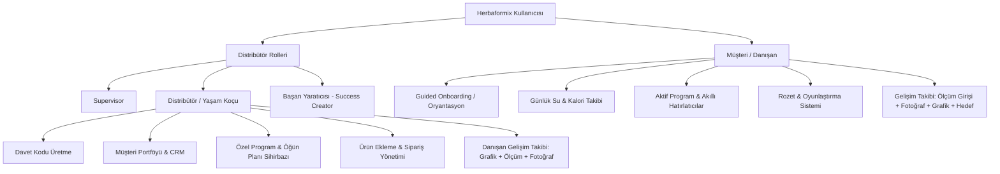

# HERBAFORMIX — ÜRÜN GEREKSİNİMLERİ DÖKÜMANI (PRODUCT REQUIREMENT DOCUMENT - PRD)

Bu döküman, **Herbaformix** sağlıklı yaşam ve beslenme takip platformunun ürün vizyonunu, fonksiyonel gereksinimlerini, teknik mimarisini, veri tabanı şemasını ve tasarım standartlarını kapsamlı bir şekilde tanımlar.

---

## PROJE KÜNYESİ

| Alan | Değer |
|---|---|
| **Proje Adı** | Herbaformix |
| **Sürüm** | v1.1.0 |
| **Hedef Kitle** | Bağımsız Distribütörler (Yaşam Koçları) ve Onların Kayıtlı Müşterileri (Danışanlar) |
| **Geliştirme Platformu** | Flutter (Android, iOS ve Web) |
| **Veri Tabanı ve Altyapı** | Firebase (Auth, Firestore, Cloud Storage, Hosting) |
| **Lokalizasyon Dili** | Türkçe (`tr_TR`) |
| **Durum Yönetimi** | Provider + ChangeNotifier |
| **Navigasyon** | GoRouter (declarative routing) |

---

## 1. PROJE ÖZETİ VE VİZYONU

Herbaformix, sağlıklı beslenme ve aktif yaşam tarzını benimseyen bireyler ile onlara rehberlik eden yaşam koçlarını (Distribütörleri) bir araya getiren mobil öncelikli bir ekosistemdir.

Uygulama iki temel sorunu çözer:
1. **Danışanlar (Müşteriler):** Günlük su tüketimlerini, öğünlerini, Herbalife ürün kullanımlarını ve kilo değişimlerini disiplinli bir şekilde takip etmekte zorlanırlar.
2. **Yaşam Koçları (Distribütörler):** Danışanlarının günlük rutinlerini, beslenme planlarını ve fiziksel gelişimlerini (ölçüler, fotoğraflar) tek tek WhatsApp veya Excel üzerinden takip etmekte zorlanırlar.

**Vizyon:** Danışanların kendi kişisel hedeflerine ulaşırken eğlenceli ve oyunlaştırılmış bir arayüzle rutinlerini takip edebildiği; yaşam koçlarının ise tüm müşteri portföyünü, siparişleri, ölçümleri ve programları tek bir CRM panelinden profesyonelce yönetebildiği hepsi bir arada (All-in-One) bir platform oluşturmaktır.

---

## 2. KULLANICI ROLLERİ VE YETKİ AĞACI

Uygulamada rol tabanlı erişim kontrolü (RBAC) uygulanır. `UserRole` enumu altında dört rol tanımlanmıştır:



### 2.1. Distribütör Rolleri

| Rol | Açıklama |
|---|---|
| **Supervisor** | En üst seviye distribütör rolü. Tüm müşteri ve distribütör verilerine erişim. |
| **Distribütör / Yaşam Koçu** | Temel koç rolü. Müşteri yönetimi, program hazırlama, gelişim takibi, sipariş yönetimi. |
| **Başarı Yaratıcısı (Success Creator)** | Distribütör ile benzer yetkiler, farklı unvan. |

**Distribütör Yetkileri:**
- **Müşteri Davet Sistemi:** Benzersiz davet kodları oluşturarak yeni müşterilerin kendi hesaplarına otomatik bağlanmasını sağlar.
- **CRM & Müşteri Listesi:** Aktif danışanlarının listesini görür, arama ve filtreler uygulayabilir. Her müşterinin detay ekranında gelişim grafiği, ölçüm geçmişi, su/kalori takibi ve risk analizi görünür.
- **Akıllı Program Hazırlama:** Her bir müşterinin hedefine özel program sihirbazını kullanarak öğün planı tanımlar.
- **Gelişim İzleme:** Müşterilerin girdiği kilo, bel, kalça, göğüs, kol, bacak, yağ oranı ve kas kütlesi ölçümlerini grafiksel olarak inceler.
- **Sipariş Yönetimi:** Müşteriler adına sipariş oluşturur veya müşterilerin ürün isteklerini takip eder.
- **Takip Sistemi:** Müşteriler için telefon, WhatsApp, e-posta veya yüz yüze takip kayıtları oluşturur ve zamanlanmış hatırlatmalar ayarlar.

### 2.2. Müşteri (Danışan)

- **Kişiselleştirilmiş Oryantasyon:** İlk girdiğinde yaş, boy, kilo, hedef kilo, cinsiyet, sağlık hedefleri, uyku/uyanma/öğle yemeği saatleri ve sağlık notlarını belirten sihirbazı tamamlar.
- **Rutin Takipçisi:** Koçu tarafından kendisine atanan beslenme ve ürün programını saat bazlı görür. Her adımı "tamamlandı" olarak işaretler.
- **Su & Kalori Takibi:** Günlük su tüketim hedefine ulaşmak için hızlı ekleme butonlarını kullanır; yediği besinlerin kalorilerini kaydeder. Su hedefi hava durumu ve egzersiz seviyesine göre dinamik olarak hesaplanır.
- **Oyunlaştırma:** Belirli hedeflere ulaştıkça (ilk ölçüm, 7/30 gün seri, kilo kayıpları, hedefe ulaşma vb.) dijital rozetler kazanır ve anlık snackbar bildirimi alır.
- **Gelişim Takibi:** Kilo ve vücut ölçümlerini girer (bel, kalça, göğüs, kol, bacak, yağ oranı, kas kütlesi), gelişim fotoğraflarını yükler, önce/sonra karşılaştırması yapar, hedef ilerleme çubuğunu izler, verilerini CSV olarak dışa aktarır.

---

## 3. FONKSİYONEL GEREKSİNİMLER

### 3.1. Üyelik, Giriş ve Davet Yönetimi
- **Giriş Yöntemleri:** Google Sign-In ve E-posta/Şifre ile entegre Firebase Authentication.
- **Distribütör-Müşteri Bağlantısı:**
  - Distribütör, 8 haneli alfanümerik benzersiz davet kodu üretir (Örn: `A3BX9K2M`).
  - Danışan kaydolurken davet kodunu girer; sistem otomatik olarak `assignedDistributorId` alanını set eder.
  - Davet kodlarının geçerlilik süresi varsayılan olarak **7 gündür**.
  - `InviteCodeModel` ile `/invite_codes/{inviteCodeId}` koleksiyonunda tutulur.
  - Davet durumu yaşam döngüsü: `pending` → `used` / `expired` (`InviteStatus` enum).
  - Davet gönderimi WhatsApp üzerinden doğrudan paylaşım linki ile yapılabilir (`WhatsappHelper`).

### 3.2. Müşteri Oryantasyonu (Customer Onboarding)
İlk kez giriş yapan danışanlar için zorunlu 5 adımlı sihirbaz:
1. **Adım 1 — Hoş Geldin:** Karşılama mesajı ve ilerleme göstergesi.
2. **Adım 2 — Kişisel Bilgiler:** İsim, yaş, telefon numarası.
3. **Adım 3 — Sağlık Hedefi:** Kilo Verme (`weight_loss`), Sağlıklı Yaşam (`healthy_living`), Kilo Alma (`weight_gain`) seçimi.
4. **Adım 4 — Mevcut Durum:** Mevcut kilo (kg), boy (cm) ve **hedef kilo (kg)** girişi.
5. **Adım 5 — Günlük Yaşam:** Uyanma saati, öğle yemeği saati, uyku saati.

- Bu bilgiler doldurulmadan ana sayfaya geçiş engellenir (`GoRouter` redirect mantığı).
- `userGoal` alanı (`weight_loss` / `healthy_living` / `weight_gain`) renk mantığını ve hedef bazlı gösterimleri etkiler.

### 3.3. Akıllı Program Sihirbazı (Program Wizard)
Distribütörlerin müşterilerine özel günlük beslenme programı hazırlamasını sağlayan 4 adımlı sihirbaz:

1. **Adım 1: Hedef Belirleme:** Kilo verme, kilo alma veya sağlıklı yaşam hedefi seçilir.
2. **Adım 2: Kilo Parametreleri:** Başlangıç kilosu ve hedef kilo tanımlanır. Sistem, hedefe göre önerilen minimum program süresini (ay bazında) otomatik hesaplar.
3. **Adım 3: Öğün ve Ürün Planlama:**
   - Günlük ana ve ara öğün slotları (`MealSlot`) saatleriyle birlikte listelenir.
   - Her bir öğün için "Normal Yemek" veya "Ürün/Shake" seçeneği belirlenir.
   - "Ürün" seçildiyse, Herbalife ürünleri kataloğundan ilgili ürünler bu öğüne eklenir.
   - Su adımları otomatik olarak her ana öğünden 30 dk önce eklenir (250 ml).
   - Distribütör istediği kadar ara öğün slotu ekleyip silebilir.
4. **Adım 4: Özet ve Kaydetme:** Program onaylanarak Firestore'a kaydedilir ve danışanın uygulamasına anında yansır. Aynı zamanda yerel bildirimler zamanlanır.

**Program Modeli (`MealSlot` / `MealProduct`):**
- `MealSlot`: `id`, `kind` (main/snack), `label`, `scheduledTime`, `isNormalMeal`, `products` listesi.
- `MealProduct`: `productId`, `productName`, `quantity`.

### 3.4. Akıllı Bildirim ve Su Hatırlatıcı Servisi
Program kaydedildiğinde veya güncellendiğinde arka planda yerel bildirimler (`flutter_local_notifications`) otomatik olarak zamanlanır. Ayrıca Firebase Cloud Messaging (FCM) altyapısı entegre edilecektir:
- **Öğün Alarmları:** Her öğünün saati geldiğinde özelleştirilmiş yerel bildirim gönderilir.
- **30 Dakika Öncesi Su Alarmları:** Her ana normal öğünden tam 30 dakika önce su içme bildirimi zamanlanır.
- **Push Bildirimleri (FCM):** Distribütörün yeni bir program hazırlaması, takip hatırlatması girmesi veya motivasyon mesajı göndermesi durumunda danışana anlık bildirim gider.
- **Token Senkronizasyonu:** Uygulama açılışında bildirim izni sorgulanır. İzin onaylandığında, cihazın güncel FCM token'ı `UserProfileModel.fcmToken` alanına yazılır.

### 3.5. Günlük Takip Modülleri

#### 3.5.1. Su Takipçisi (`WaterTrackerScreen`)
- Gerçek zamanlı Firestore senkronizasyonu ile çalışır.
- Günlük su hedefi dinamik olarak hesaplanır (`WaterCalculationEngine`):
  - Baz su miktarı vücut ağırlığına göre belirlenir.
  - Egzersiz seviyesi (sedentary, light, moderate, intense) eklenir.
  - Hava durumu verisi (sıcaklık, nem) OpenWeatherMap API'den çekilerek hesaba katılır.
- **Hata Toleransı ve Fallback (Graceful Degradation):**
  - OpenWeatherMap API çağrı limiti aşıldığında, ağ bağlantısı olmadığında (offline mod) veya API anahtarı hatası alındığında sistem çökmeyecektir.
  - Fallback durumunda hava sıcaklığı varsayılan olarak 22°C (oda sıcaklığı) ve nem oranı %50 kabul edilerek sadece vücut ağırlığı ve egzersiz bazlı "Standart Su Hedefi" hesaplanır.
- Kullanıcı tek tıkla su ekleyebilir (+250ml, +500ml) veya özel miktar girebilir.
- Su günlüğü `/users/{userId}/water_logs/{YYYY-MM-DD}` koleksiyonunda tutulur.
- Su özet verisi `/users/{userId}/waterSummaries/{YYYY-MM-DD}` koleksiyonunda tutulur.

#### 3.5.2. Kalori Takipçisi (`CalorieTrackerScreen`)
- Tüketilen yiyeceklerin adı ve kalori değeri girilir (`MealModel`).
- Günlük toplam alınan kalori hedef limitine göre renk değiştirerek görselleştirilir.
- **Bilinen Kısıtlama:** `CalorieProvider` şu an yerel state'te çalışmaktadır; Firestore'a kalıcı kayıt yapılmamaktadır.

### 3.6. Gelişim Takibi ve Fotoğraf Günlüğü

#### 3.6.1. Ölçüm Girişi ve Geçmişi
Danışanlar düzenli aralıklarla şu ölçümleri girer:

| Ölçüm | Birim | Zorunlu mu? |
|---|---|---|
| Kilo | kg | Evet |
| BMI | — | Otomatik hesaplanır (boy gerektirir) |
| Bel | cm | Hayır |
| Kalça | cm | Hayır |
| Göğüs | cm | Hayır |
| Kol | cm | Hayır |
| Bacak | cm | Hayır |
| Yağ Oranı | % | Hayır |
| Kas Kütlesi | kg | Hayır |

- **Ölçüm Formu (`AddMeasurementSheet`):** Kilo zorunlu, diğer ölçümler opsiyonel (açılır/kapanır bölüm). Virgül ve nokta girişi desteklenir. Geçmiş tarihli ölçüm girilebilir (DatePicker). Aynı gün zaten kayıt varsa uyarı dialogu gösterilir.
- **Ölçüm Geçmişi Tablosu (`MeasurementsHistoryScreen`):** Tüm kayıtlar tablo görünümünde listelenir, düzenleme ve silme desteklenir. Route: `/measurements-history`.

#### 3.6.2. Gelişim Grafikleri
- **Genelleştirilmiş Grafik Widget'ı (`WeightChartWidget`):** `MeasurementType` enum parametresiyle her ölçüm türü için grafik çizilir:
  - `weight` (Kilo), `waist` (Bel), `hip` (Kalça), `chest` (Göğüs), `arm` (Kol), `thigh` (Bacak), `bodyFat` (Yağ Oranı), `muscleMass` (Kas Kütlesi)
- Zaman aralığı filtreleri: 1 Hafta, 1 Ay, 3 Ay.
- **Hedef Kilo Çizgisi:** Kilo grafiğinde turuncu kesikli yatay çizgi + "Hedef XX.X" etiketi.
- **Hedef Bazlı Renk Mantığı:** `userGoal == 'weight_loss'` → azalış yeşil / artış kırmızı; `userGoal == 'weight_gain'` → artış yeşil / azalış kırmızı.
- Gizlilik modunda BMI gösterilir, kilo ve ölçüler `***` ile maskelenir.

#### 3.6.3. Hedef İlerleme Çubuğu
- Dairesel `CircularProgressIndicator` ile mevcut kilonun hedef kiloya oranını gösterir.
- Başlangıç / Mevcut / Hedef / Kalan bilgileri listelenir.
- İlerleme yüzdesi hesaplaması hedef tipine göre yapılır (kilo verme vs. kilo alma).
- `%100` ulaşıldığında "Ulaşıldı!" yeşil etiketi gösterilir.

#### 3.6.4. İstatistik Özet Kartı
- **Haftalık Ortalama Değişim:** kg/hafta cinsinden ortalama kilo değişim hızı.
- **Toplam Kayıt Sayısı:** Girilen ölçüm kaydı sayısı.
- **En İyi Hafta:** En çok ilerleme kaydedilen hafta ve miktarı.
- Renkler hedef bazlı (azalış/artış yeşil/kırmızı).

#### 3.6.5. Gelişim Fotoğrafları (`ProgressPhotosScreen`)
- "Önce" (gri tonlamalı) ve "Sonra" (renkli) fotoğraf yükleme (kamera/galeri).
- Carousel (PageView) + dot indicator ile gezinme.
- Tam ekran görüntüleyici (InteractiveViewer ile zoom/pan).
- **Önce/Sonra Karşılaştırma Aracı:** Slider ile sürükle-bırak yan yana karşılaştırma. Gri tonlamalı "önce" fotoğrafı ile renkli "sonra" fotoğrafı üst üste bindirilir. Dikey çizgi + tutamak ile bölge ayarlanır. Birden fazla "sonra" fotoğrafı arasından seçim yapılabilir.
- **Bilinen Kısıtlama:** Fotoğraflar şu an yerel dosya sisteminde (SharedPreferences ile path saklama) tutulmaktadır. Firebase Storage entegrasyonu henüz yapılmamıştır. Cihaz değiştirildiğinde veya uygulama silindiğinde fotoğraflar kaybolur.

#### 3.6.6. Dijital Mezura
Müşteri ana gelişim ekranında bel, kalça ve göğüs son ölçümleri ile değişim miktarları gösterilir. Değişim renkleri hedef bazlıdır.

#### 3.6.7. CSV Dışa Aktarma
Dashboard ekranında download ikonu ile tüm ölçüm verileri CSV formatında dışa aktarılır. `share_plus` paketi ile paylaşım sağlanır. CSV başlıkları: Tarih, Kilo, BMI, Bel, Kalça, Göğüs, Kol, Bacak, Yağ Oranı, Kas Kütlesi.

#### 3.6.8. Distribütör Tarafı Gelişim Görünümü
Distribütör, müşteri detay ekranında (`CustomerDetailScreen`) şu gelişim verilerini görebilir:
- Kilo değişim grafiği (WeightChartWidget)
- Bel, kalça, göğüs değişim chip'leri
- Son 5 ölçüm kaydının listesi (tarih + tüm ölçümler)
- Veriler `DistributorCustomerInsights.progressEntries` üzerinden son 90 günlük kayıtları içerir.

### 3.7. Rozet ve Oyunlaştırma Sistemi

8 adet rozet tanımı (`AppBadges` statik listesi):

| Rozet ID | Etiket | Kazanma Koşulu |
|---|---|---|
| `first_entry` | İlk Adım | İlk ölçüm kaydı eklendiğinde |
| `streak_7` | 7 Gün Seri | 7 gün üst üste aktivite (ölçüm, su, routine) |
| `streak_30` | 30 Gün Seri | 30 gün üst üste aktivite |
| `lost_1kg` | 1 KG Kayıp | Toplam 1+ kg kayıp |
| `lost_5kg` | 5 KG Kayıp | Toplam 5+ kg kayıp |
| `goal_reached` | Hedefe Ulaştı | Mevcut kilo hedef kiloya ulaştığında (hedef tipine göre) |
| `measurement_added` | Ölçüm Ustası | En az 1 vücut ölçümü (bel/kalça/göğüs/kol/bacak/yağ/kas) girildiğinde |
| `photo_added` | Dönüşüm Fotoğrafı | Dönüşüm fotoğrafı yüklendiğinde |

- Rozetler `ProgressProvider._checkAndAwardBadges` metodunda kontrol edilir ve Firestore'a kaydedilir.
- **Anlık Bildirim:** Rozet kazanıldığında `onBadgeEarned` callback'i tetiklenir ve müşteri ekranında snackbar gösterilir.
- **Hedef Bazlı Rozet Mantığı:** `goal_reached` rozeti `userGoal`'a göre hesaplanır: `weight_loss` → mevcut kilo hedefe eşit/altı, `weight_gain` → mevcut kilo hedefe eşit/üstü.
- **Genişletilmiş Seri Hesabı:** `updateActivityDates()` metodu ile su dolumu ve routine tamamlama tarihleri de seri hesabına dahil edilebilir.

### 3.8. Ürün Kataloğu ve Sipariş Takibi
- **Ürün Kataloğu (`ProductListScreen`):** Herbalife ürünlerinin listelendiği, arama ve filtreleme yapılabilen katalog. Ürün detay ekranı ve resim görüntüleyici mevcuttur.
- **Sipariş Ekranı:** Distribütörler, danışanları için sipariş oluşturur. Sipariş durumu: `pending` → `processing` → `shipped` → `delivered` / `cancelled` (`OrderStatus` enum).
- **Sepet Sistemi:** `CartProvider` ile ürün ekleme/çıkarma ve toplam hesaplama.
- **Ürün Kullanım İstatistikleri (`DistributorProductUsageScreen`):** Hangi ürünlerin kaç müşteri tarafından aktif programlarda kullanıldığını listeler.

### 3.9. Müşteri Takip Sistemi (Follow-Up)
- Distribütörler müşterileri için takip kayıtları oluşturabilir.
- **Takip Tipleri:** Telefon, WhatsApp, E-posta, Yüz Yüze (`FollowUpType` enum).
- **Takip Durumları:** Tamamlandı, Eylem Gerekiyor (`FollowUpStatus` enum).
- **Zamanlanmış Takipler:** İleriki tarihler için hatırlatma ayarlanabilir (`ScheduledFollowUpModel`).

### 3.10. Profil Yönetimi
- **Kişisel Bilgiler:** İsim, yaş, telefon, boy, kilo, hedef kilo, cinsiyet, doğum tarihi.
- **Sağlık Hedefleri:** Hedef tipi, uyku/uyanma/öğle saatleri, su hedefi.
- **Sağlık Notları:** Alerjiler, ilaçlar, sağlık notları (max 1000 karakter).
- **Uygulama Ayarları:** Bildirim, ses ve dil tercihi.
- **Davet Kodu Yönetimi:** Distribütörler davet kodlarını görüntüleyip yeni kod üretebilir.
- **Profil Fotoğrafı:** Yükleme ve güncelleme desteği.
- **Şifre Değiştirme:** Dialog ile şifre güncelleme.

### 3.11. Müşteri Destek Ekranı
- Müşterilerin distribütörleriyle iletişim kurmasını sağlayan destek ekranı.

---

## 4. VERİ TABANI MODELLERİ VE ŞEMALARI

Veriler Firestore üzerinde döküman-koleksiyon yapısında tutulur.

### 4.1. Kullanıcı Profili (`UserProfileModel`)
**Koleksiyon:** `/users/{userId}`

| Alan | Tür | Açıklama |
|---|---|---|
| `id` | String | Firebase Auth UID |
| `email` | String | Kullanıcı e-postası |
| `role` | String | `supervisor` / `distributor` / `successCreator` / `customer` |
| `name` | String? | Ad Soyad |
| `distributorLevel` | String? | Distribütör seviyesi |
| `monthlyVPTarget` | int? | Aylık VP hedefi |
| `isOnboarded` | bool | Onboarding tamamlandı mı? |
| `age` | int? | Yaş |
| `phoneNumber` | String? | Telefon |
| `weight` | double? | Mevcut kilo (kg) |
| `height` | double? | Boy (cm) |
| `targetWeight` | double? | Hedef kilo (kg) — sayısal alan |
| `programStartDate` | DateTime? | Program başlangıç tarihi |
| `userGoal` | String | `weight_loss` / `healthy_living` / `weight_gain` |
| `wakeTime` | String? | Uyanma saati (Örn: "07:30") |
| `lunchTime` | String? | Öğle yemeği saati |
| `sleepTime` | String? | Uyku saati |
| `birthDate` | DateTime? | Doğum tarihi |
| `gender` | String? | "Kadın" / "Erkek" / "Belirtmek İstemiyorum" |
| `healthNotes` | String? | Sağlık notları (max 1000) |
| `allergies` | String? | Alerjiler (max 1000) |
| `medications` | String? | İlaçlar (max 1000) |
| `assignedDistributorId` | String? | Bağlı distribütör UID |
| `profilePhotoUrl` | String? | Profil fotoğrafı URL (Yerel profil resmi desteği için yedek) |
| `profilePhotoUpdatedAt` | DateTime? | Fotoğraf güncelleme tarihi |
| `earnedBadges` | List\<String\> | Kazanılan rozet ID'leri |
| `waterDailyGoal` | int? | Günlük su hedefi (ml) |
| `waterMinLimit` | int? | Distribütör min su limiti (ml) |
| `waterMaxLimit` | int? | Distribütör max su limiti (ml) |
| `distributorRequestStatus` | String? | `null` / `pending` / `approved` |
| `fcmToken` | String? | Push bildirimleri ve zamanlanmış hatırlatıcılar için cihaz token'ı |
| `notificationSettings` | Map\<String, bool\>? | Kullanıcı bildirim tercihleri (Örn: `{"meals": true, "water": true, "followUp": true}`) |

**Not:** Eski `goal` alanı P1.9 ile kaldırıldı. Yeni kayıtlarda yalnızca sayısal `targetWeight` kullanılır. Tüm db alanları camelCase standardına getirilmiştir; `user_goal`, `wake_time`, `lunch_time`, `sleep_time` snake_case alanları P1.6 ile camelCase'e taşınacaktır.

### 4.2. Gelişim Ölçüm Kaydı (`ProgressEntryModel`)
**Koleksiyon:** `/users/{userId}/progressEntries/{entryId}`

| Alan | Tür | Açıklama |
|---|---|---|
| `id` | String | Belge ID |
| `date` | Timestamp | Ölçüm tarihi |
| `weight` | double | Kilo (kg) — zorunlu |
| `bmi` | double? | Vücut Kitle İndeksi (otomatik hesaplanır) |
| `waist` | double? | Bel (cm) |
| `hip` | double? | Kalça (cm) |
| `chest` | double? | Göğüs (cm) |
| `bodyFat` | double? | Yağ oranı (%) |
| `muscleMass` | double? | Kas kütlesi (kg) |
| `arm` | double? | Kol (cm) |
| `thigh` | double? | Bacak (cm) |

### 4.3. Davet Kodu (`InviteCodeModel`)
**Koleksiyon:** `/invite_codes/{inviteCodeId}`

| Alan | Tür | Açıklama |
|---|---|---|
| `code` | String | 8 haneli benzersiz kod |
| `distributorId` | String | Kodu üreten koçun UID'si |
| `createdAt` | Timestamp | Oluşturulma tarihi |
| `expiresAt` | Timestamp | Son kullanma tarihi (7 gün) |
| `status` | String | `pending` / `used` / `expired` |
| `isUsed` | bool | Kullanıldı mı? |
| `usedByUserId` | String? | Kullanan danışanın UID'si |
| `customerName` | String? | Danışan adı |
| `customerPhone` | String? | Danışan telefonu |

### 4.4. Beslenme Programı (`ProgramModel`)
**Koleksiyon:** `/users/{userId}/programs/{programId}`

| Alan | Tür | Açıklama |
|---|---|---|
| `id` | String | Aktif program için genellikle "active" |
| `userGoal` | String | Hedef tipi |
| `startDate` | Timestamp | Başlangıç tarihi |
| `durationMonths` | int | Süre (ay) |
| `isActive` | bool | Aktif mi? |
| `slots` | List\<Map\> | `MealSlot` dizisi |

**MealSlot yapısı:**
| Alan | Tür | Açıklama |
|---|---|---|
| `id` | String | Slot ID |
| `kind` | String | `main` / `snack` |
| `label` | String | Örn: "Kahvaltı" |
| `scheduledTime` | String | Örn: "08:30" |
| `isNormalMeal` | bool | Normal yemek mi? |
| `products` | List\<Map\> | `MealProduct` dizisi |

**MealProduct yapısı:**
| Alan | Tür | Açıklama |
|---|---|---|
| `productId` | String | Ürün ID |
| `productName` | String | Ürün adı |
| `quantity` | double | Miktar |

### 4.5. Günlük Rutin (`DailyRoutineModel`)
**Koleksiyon:** `/users/{userId}/dailyRoutines/{routineId}`

| Alan | Tür | Açıklama |
|---|---|---|
| `id` | String | Belge ID |
| `product_id` | String | Ürün ID (su adımları için `water_step`) |
| `scheduled_time` | Timestamp | Planlanan saat |
| `is_completed` | bool | Tamamlandı mı? |
| `step_type` | String | `product` / `water` / `normalMeal` |
| `amount_ml` | int? | Su miktarı (yalnızca water tipi) |
| `slot_id` | String? | Hangi kalıcı slot'tan üretildi |

### 4.6. Su Tüketim Günlüğü (`WaterLogModel`)
**Koleksiyon:** `/users/{userId}/water_logs/{YYYY-MM-DD}`

| Alan | Tür | Açıklama |
|---|---|---|
| `amount` | int | Toplam içilen su (ml) |
| `updatedAt` | Timestamp | Güncelleme tarihi |

### 4.7. Su Özeti (`WaterSummaryModel`)
**Koleksiyon:** `/users/{userId}/waterSummaries/{YYYY-MM-DD}`

| Alan | Tür | Açıklama |
|---|---|---|
| `id` | String | Tarih string'i (YYYY-MM-DD) |
| `targetMl` | int | Günlük hedef (ml) |
| `exerciseLevel` | String | Egzersiz seviyesi |
| `weatherTemp` | double? | Hava sıcaklığı |
| `weatherHumidity` | double? | Nem oranı |
| `weatherStatus` | String? | Hava durumu açıklaması |
| `isWeatherFetched` | bool | Hava verisi çekildi mi? |
| `updatedAt` | Timestamp | Güncelleme tarihi |

### 4.8. Sipariş (`OrderModel`)
**Koleksiyon:** `/orders/{orderId}`

| Alan | Tür | Açıklama |
|---|---|---|
| `id` | String | Belge ID |
| `customerId` | String | Müşteri UID |
| `distributorId` | String | Distribütör UID |
| `items` | List\<Map\> | `OrderItemModel` nesnelerinden oluşan dizi |
| `status` | String | `pending` / `processing` / `shipped` / `delivered` / `cancelled` |
| `totalAmount` | double | Toplam fatura tutarı |
| `totalVolumePoint` | double | Siparişten kazanılan toplam Volume Point (VP) |
| `createdAt` | Timestamp | Oluşturulma tarihi |
| `updatedAt` | Timestamp | Güncelleme tarihi |
| `notes` | String? | Notlar |

### 4.8.1. Sipariş İçeriği (`OrderItemModel`)
*Firestore içinde bağımsız bir koleksiyon değildir, `OrderModel` altında map listesi olarak saklanır.*

| Alan | Tür | Açıklama |
|---|---|---|
| `productId` | String | Ürün ID |
| `productName` | String | Ürün adı |
| `price` | double | Sipariş anındaki birim fiyat |
| `volumePoint` | double | Sipariş anındaki birim VP |
| `quantity` | int | Satın alınan adet |

### 4.9. Ürün (`ProductModel`)
**Koleksiyon:** `/products/{productId}`

| Alan | Tür | Açıklama |
|---|---|---|
| `id` | String | Belge ID |
| `name` | String | Ürün adı |
| `description` | String? | Açıklama |
| `category` | String? | Kategori |
| `price` | double? | Fiyat |
| `volumePoint` | double | Ürünün Volume Point (VP) değeri |
| `imageUrl` | String? | Ürün resmi URL |
| `isActive` | bool | Aktif mi? |

### 4.10. Müşteri Modeli (`CustomerModel`)
CRM amaçlı distribütör tarafında kullanılan müşteri temsil modeli.

### 4.11. Takip Kaydı (`FollowUpModel`)
| Alan | Tür | Açıklama |
|---|---|---|
| `id` | String | Belge ID |
| `type` | String | `phoneCall` / `whatsappMessage` / `email` / `inPerson` |
| `status` | String | `completed` / `requiresAction` |
| `note` | String? | Not |

### 4.12. Zamanlanmış Takip (`ScheduledFollowUpModel`)
İleriki tarihler için hatırlatma ayarlanmasını sağlar.

### 4.13. Distribütör Müşteri İçgörüleri (`DistributorCustomerInsights`)
Distribütör tarafında müşteri özet verisi. Doğrudan Firestore koleksiyonu değil, hizmet modeli:

| Alan | Tür | Açıklama |
|---|---|---|
| `latestProgress` | ProgressEntryModel? | Son ölçüm kaydı |
| `progressEntries` | List\<ProgressEntryModel\> | Son 90 günlük tüm kayıtlar |
| `todayWaterMl` | int | Bugünkü su tüketimi |
| `waterGoalMl` | int | Su hedefi |
| `completedRoutinesLast7Days` | int | Son 7 gün tamamlanan rutin |
| `totalRoutinesLast7Days` | int | Son 7 gün toplam rutin |
| `lastActivityAt` | DateTime? | Son aktivite tarihi |
| `completionRate` | double | Rutin tamamlama oranı |
| `isAtRisk` | bool | 3+ gün inaktif veya tamamlama < %50 |
| `totalWeightChange` | double | Toplam kilo değişimi |

### 4.14. Rozet Tanımı (`BadgeDefinition`)
Statik liste, Firestore'da saklanmaz. Yalnızca kazanılan rozet ID'leri (`earnedBadges`) kullanıcı profiline yazılır.

### 4.15. Öğün Modeli (`MealModel`)
Kalori takibi için yerel model. Firestore'a kalıcı kayıt yapılmaz.

### 4.16. Yerel Fotoğraf Modeli (`LocalProgressPhotoModel`)
*Firestore'da saklanmaz. Cihazın yerel veritabanında (SQLite, Hive veya SharedPreferences) depolanır.*

| Alan | Tür | Açıklama |
|---|---|---|
| `id` | String | Benzersiz dosya ID |
| `date` | DateTime | Fotoğrafın çekildiği/eklendiği tarih |
| `localPath` | String | Cihaz üzerindeki mutlak/göreli dosya yolu |
| `type` | String | `before` (önce) / `after` (sonra) |
| `weight` | double? | Fotoğrafın çekildiği tarihteki kilo |

---

## 5. EKRAN HARİTASI VE ROUTING

### 5.1. Route Tablosu

| Route | Ekran | Erişim |
|---|---|---|
| `/` | `SplashScreen` | Herkes |
| `/login` | `LoginScreen` | Herkes |
| `/home` | `HomeScreen` (rol bazlı içerik) | Giriş yapmış |
| `/onboarding` | `CustomerOnboardingScreen` | Yeni müşteri |
| `/create-program` | `CreateProgramScreen` | Distribütör |
| `/active-program` | `ActiveProgramScreen` | Müşteri |
| `/progress-dashboard` | `ProgressDashboardScreen` | Müşteri |
| `/progress-photos` | `ProgressPhotosScreen` | Müşteri |
| `/measurements-history` | `MeasurementsHistoryScreen` | Müşteri |
| `/customer-products` | `CustomerProductsScreen` | Müşteri |
| `/customer-support` | `CustomerSupportScreen` | Müşteri |
| `/distributor-usage` | `DistributorProductUsageScreen` | Distribütör |
| `/profile` | `ProfileScreen` | Herkes |
| `/personal-info` | `PersonalInfoScreen` | Herkes |
| `/health-goals` | `HealthGoalsScreen` | Herkes |
| `/app-settings` | `AppSettingsScreen` | Herkes |
| `/support` | `SupportScreen` | Herkes |

### 5.2. Müşteri Bottom Navigation

| Index | Sekme | İkon |
|---|---|---|
| 0 | Ana Sayfa | `Icons.home` |
| 1 | Programım | `Icons.restaurant_menu` |
| 2 | Gelişim | `Icons.trending_down` |
| 3 | Profil | `Icons.person` |

### 5.3. Distribütör Bottom Navigation

| Index | Sekme | İkon |
|---|---|---|
| 0 | Ana Sayfa | `Icons.home` |
| 1 | Müşteriler | `Icons.people` |
| 2 | Siparişler | `Icons.shopping_bag` |
| 3 | Profil | `Icons.person` |

---

## 6. TEKNİK MİMARİ VE TEKNOLOJİK ALTYAPI

### 6.1. Mimari Katmanlar
Uygulama **Feature-First (Özellik Öncelikli)** klasör yapısını benimser:

```
lib/
├── app.dart                    # MaterialApp + Provider ağacı
├── main.dart                   # Firebase init + uygulama başlangıcı
├── core/
│   ├── app_colors.dart         # Renk paleti sabitleri
│   ├── avatar_color_helper.dart# Avatar renk yardımcısı
│   ├── router.dart             # GoRouter route tanımları
│   └── utils/
│       ├── water_calculation_engine.dart  # Dinamik su hesaplama
│       └── whatsapp_helper.dart           # WhatsApp paylaşım yardımcısı
├── features/
│   ├── auth/                   # Giriş, kayıt, onboarding
│   │   ├── providers/          # AuthProvider
│   │   └── screens/            # Login, Splash, Onboarding
│   ├── calorie_tracker/        # Kalori takibi
│   │   ├── models/             # MealModel
│   │   ├── providers/          # CalorieProvider
│   │   └── screens/            # CalorieTrackerScreen
│   ├── customers/              # CRM, müşteri listesi/detay
│   │   ├── providers/          # CustomerProvider, FollowUpProvider
│   │   └── screens/            # CustomerList, Detail, AddEdit
│   ├── home/                   # Ana sayfa, müşteri ekranları
│   │   ├── providers/          # HomeProvider
│   │   ├── screens/            # HomeScreen, CustomerProgress, vb.
│   │   └── widgets/            # DailySuccessRing, MotivationWidget
│   ├── orders/                 # Sipariş yönetimi
│   │   ├── providers/          # CartProvider, OrderProvider
│   │   └── screens/            # OrderList, Cart, AddEditOrder
│   ├── products/               # Ürün kataloğu
│   │   ├── providers/          # ProductProvider
│   │   └── screens/            # ProductList, Detail, AddEdit
│   ├── profile/                # Profil yönetimi
│   │   ├── screens/            # Profile, PersonalInfo, HealthGoals, vb.
│   │   ├── utils/              # ProfileValidators
│   │   └── widgets/            # CustomerProfileView, DistributorProfileView, vb.
│   ├── program/                # Beslenme programı
│   │   ├── models/             # ProgramModel, ProgramEditorArgs
│   │   ├── providers/          # ProgramProvider
│   │   ├── screens/            # CreateProgram, ActiveProgram
│   │   ├── services/           # NotificationService, ProgramService
│   │   └── widgets/            # GoalSelection, MealPlan, WeightInput, Summary
│   ├── progress/               # Gelişim takibi
│   │   ├── providers/          # ProgressProvider
│   │   ├── screens/            # Dashboard, Photos, MeasurementsHistory
│   │   └── widgets/            # WeightChartWidget, AddMeasurementSheet, TransformationStudio
│   └── water_tracker/          # Su takibi
│       ├── providers/          # WaterProvider
│       ├── screens/            # WaterTrackerScreen
│       └── utils/              # WaterCalculationConstants
├── models/                     # Veri modelleri (tüm uygulama genelinde)
├── services/                   # Firestore, Auth, Exercise, Weather, Routine servisleri
├── utils/                      # Genel yardımcı fonksiyonlar
└── widgets/                    # Paylaşılan widget'lar (AppDrawer, CachedProductImage)
```

### 6.2. Durum Yönetimi (State Management)
- **Provider + ChangeNotifier** mimarisi kullanılır.
- Asenkron işlemler (Firestore veri akışları) `Stream` dinleyicileriyle koordine edilir.
- Veri tabanında güncellendiği anda arayüz anında yenilenir.

### 6.3. Bağımlılıklar (pubspec.yaml — temel paketler)

| Paket | Amaç |
|---|---|
| `flutter` | UI framework |
| `firebase_core` | Firebase başlatma |
| `firebase_auth` | Kimlik doğrulama |
| `cloud_firestore` | Veri tabanı |
| `firebase_storage` | Dosya depolama |
| `google_sign_in` | Google girişi |
| `go_router` | Declarative routing |
| `provider` | Durum yönetimi |
| `fl_chart` | Grafik çizimi |
| `flutter_local_notifications` | Yerel bildirimler |
| `image_picker` | Kamera/galeri erişimi |
| `shared_preferences` | Yerel ayar depolama |
| `share_plus` | Dosya/paylaşım |
| `path_provider` | Geçici dizin erişimi |
| `intl` | Tarih/sayı formatlama (tr_TR) |

### 6.4. Güvenlik ve Firestore Kuralları
- Distribütörler yalnızca kendi davet kodlarını, kendi müşterilerinin verilerini okuyup yazabilir.
- Müşteriler yalnızca kendi profillerini, günlüklerini ve gelişim verilerini görebilir.

### 6.5. Yerel Fotoğraf Depolama Politikası ve Sınırlamaları
- Firebase Storage maliyetlerinden kaçınmak amacıyla gelişim fotoğrafları tamamen cihazın yerel dosya sisteminde (`path_provider` yardımıyla `ApplicationDocumentsDirectory/progress_photos/` altında) saklanır.
- Dosya yolları ve tarih eşleşmeleri yerel SQLite veya Hive veritabanında `LocalProgressPhotoModel` şemasına göre indekslenir.
- **Kritik Risk Bildirimi:** Uygulama silindiğinde, önbellek temizlendiğinde veya cihaz değiştirildiğinde yerel fotoğraflar tamamen kaybolur. Müşteri ekranında bu risk hakkında kalıcı bir bilgilendirme metni yer alacaktır.
- **Web Platformu Kısıtlaması:** Web platformunda yerel dosya sistemi (File API) doğrudan disk erişimine izin vermediği için web tarayıcısında `IndexedDB` kullanılacak veya web kullanıcılarına bu özelliğin sadece mobil platformlarda tam desteklendiği uyarısı gösterilecektir.

### 6.6. Offline Persistence (Çevrimdışı Çalışma Politikası)
- Firestore'un çevrimdışı veri saklama özelliği (`FirebaseFirestore.instance.settings = const Settings(persistenceEnabled: true)`) aktif edilecektir.
- Kullanıcı interneti olmadığında da günlük su ekleyebilir, rutinlerini tamamlayabilir veya ölçüm girebilir. Cihaz internete bağlandığı anda Firestore arka planda kuyruğa alınan tüm yazma işlemlerini sunucuyla senkronize eder.

### 6.7. Resim Sıkıştırma ve Optimizasyon
- Kullanıcının yerel diskini doldurmamak adına, kameradan çekilen veya galeriden seçilen gelişim fotoğrafları doğrudan kaydedilmez.
- `flutter_image_compress` paketi kullanılarak fotoğraflar maksimum 1080px genişliğe/yükseğe sınırlandırılır, JPEG formatında %80 kalite oranıyla sıkıştırılarak diske yazılır.

---

## 7. TASARIM VE ARAYÜZ STANDARTLARI (UI/UX)

### 7.1. Kurumsal Renk Paleti (`AppColors`)

| Renk | Hex Kodu | Kullanım |
|---|---|---|
| **Primary (Canlı Yeşil)** | `#7AC144` | Butonlar, aktif sekmeler, ana vurgular |
| **Secondary (Çimen Yeşili)** | `#42A146` | Tamamlayıcı yeşil |
| **Accent (Mango Sarısı)** | `#EFAC29` | Rozetler, başarı kutlamaları, CTA |
| **Error (Papaya Kırmızısı)** | `#D24A39` | Hatalar, silme, uyarılar |
| **Background (Açık Gri)** | `#F5F5F5` | Premium zemin |
| **Night Sky (Gece Siyahı)** | `#101820` | Ana metinler |
| **Rosemary (Biberiye Grisi)** | `#575757` | İkincil açıklamalar |

### 7.2. Tipografi ve Görsel Tasarım İlkeleri
- **Yazı Tipi:** Modern ve okunaklı **Inter** veya **Roboto**.
- **Kenar Yuvarlaklıkları:** Kart ve butonlarda yumuşak `BorderRadius.circular(10-20)`.
- **Görsel Zenginlik:**
  - Su ekleme işlemlerinde hafif dalgalanma animasyonları.
  - Kart tasarımlarında derinlik hissi veren hafif gölgelendirmeler.
  - Splash ekranında marka logosunun akıcı animasyon geçişi.
  - Yüklenemeyen ürün fotoğrafları için şık yedek (fallback) görseller.
  - Rozet kazanıldığında snackbar bildirimi.

### 7.3. Erişilebilirlik ve Kontrast Standartları (a11y)
- **Ekran Okuyucu Desteği (Semantics):** Tüm etkileşimli butonlar, grafik barları (`fl_chart` üzerindeki noktalar), su ekleme butonları ve form alanları `Semantics` veya `ExcludeSemantics` widget'ları ile sarmalanarak anlamlı etiketlerle donatılacaktır.
- **Kontrast Oranları:** Metin ve arka plan renkleri arasındaki kontrast, en az WCAG AA standardını (4.5:1) karşılayacaktır. Mango sarısı (`#EFAC29`) gibi açık renkli arka planlar üzerinde beyaz yazı yerine Gece Siyahı (`#101820`) metinler kullanılacaktır.

### 7.4. Tema Yönetimi ve Kod Standartları
- **Tema Dökümanı (`tema.md`):** Proje dizininde `tema.md` dosyası bulunması durumunda, yeni bileşenler ve ekranlar geliştirilirken bu dökümandaki renk, font, margin/padding ve gölge stilleri birebir uygulanmalıdır.
- **Sihirli Sayılar (Magic Numbers):** Tasarımdaki renk kodları, padding değerleri ve sabitler kod içerisine doğrudan ("hardcoded") yazılmayacaktır. Tüm bu değerler `AppColors` veya `AppTheme` sınıflarında enum/sabit olarak tanımlanmalıdır.

---

## 8. MEVCUT DURUM VE BİLİNEN KISITLAMALAR

### Tamamlanmış Özellikler
- [x] Firebase Auth (E-posta/Şifre + Google Sign-In)
- [x] Distribütör-Müşteri bağlantı sistemi (davet kodu)
- [x] Müşteri onboarding sihirbazı (5 adım + hedef kilo)
- [x] Akıllı program sihirbazı (4 adım + öğün/ürün planlama)
- [x] Yerel bildirim zamanlama (öğün + su hatırlatıcı)
- [x] Su takibi (dinamik hedef, hava durumu, egzersiz seviyesi)
- [x] Kalori takibi (yerel state)
- [x] Gelişim ölçüm girişi (9 alan: kilo, BMI, bel, kalça, göğüs, kol, bacak, yağ oranı, kas kütlesi)
- [x] Ölçüm grafikleri (genelleştirilmiş MeasurementType, 8 ölçüm türü)
- [x] Hedef kilo çizgisi (dashed horizontal line)
- [x] Hedef ilerleme çubuğu (dairesel progress)
- [x] Hedef bazlı renk mantığı (weight_loss / weight_gain)
- [x] Gelişim fotoğrafları (önce/sonra, karşılaştırma slider)
- [x] İstatistik özet kartı (haftalık ortalama, en iyi hafta, toplam kayıt)
- [x] CSV dışa aktarma (share_plus)
- [x] Geçmiş tarihli ölçüm girişi (DatePicker)
- [x] Aynı gün tekrar uyarısı (dialog)
- [x] Rozet sistemi (8 rozet + anlık snackbar bildirimi)
- [x] Genişletilmiş seri hesabı (su/routine aktiviteleri dahil)
- [x] Gizlilik modu (BMI gösterimi, kilo maskeleme)
- [x] Distribütör müşteri detayında gelişim bölümü (grafik + ölçümler)
- [x] Ölçüm geçmişi tablosu (route + CRUD)
- [x] RefreshIndicator (provider yeniden yükleme)
- [x] CRM ve müşteri listesi/detay
- [x] Takip sistemi (FollowUp + ScheduledFollowUp)
- [x] Ürün kataloğu ve sipariş yönetimi
- [x] Sepet sistemi
- [x] Ürün kullanım istatistikleri
- [x] Profil yönetimi (kişisel, sağlık, ayarlar, davet kodu)

### Bilinen Kısıtlamalar
- **Kalori Takibi:** `CalorieProvider` yerel state'te çalışır; Firestore'a kalıcı kayıt yapılmaz. Sayfa yenilendiğinde veriler sıfırlanır.
- **Gelişim Fotoğrafları (Maliyet Odaklı Tercih):** Fotoğraflar yerel dosya sisteminde (`LocalProgressPhotoModel`) tutulmaktadır. Cihaz değiştirildiğinde veya uygulama silindiğinde fotoğraflar kaybolur. Distribütör, danışanın fotoğraflarını göremez. Web platformunda tarayıcı disk kısıtlamaları mevcuttur.
- **Google Sign-In:** Firebase Auth altyapısı hazır; uçtan uca test edilmesi gerekmektedir.
- **Test Altyapısı:** Unit test ve integration test bulunmamaktadır.
- **Erişilebilirlik:** Çalışmalar başlatılmış olup, semantic label'lar ve ekran okuyucu desteği v1.1.0 revizyonu ile zorunlu kılınmıştır.

---

## 9. GELECEK YOL HARİTASI (FUTURE ROADMAP)

Gelecek sürümlerde (v2.0.0+) eklenmesi planlanan vizyoner özellikler:

1. **Opsiyonel Firebase Storage Fotoğraf Bulut Yedekleme (Ücretli/Premium Model):** İsteyen kullanıcılar veya distribütörler için ücretli bulut depolama aboneliği getirilerek gelişim fotoğraflarının güvenli bir şekilde yedeklenmesi ve distribütörle paylaşılması.
2. **Kalori Takibi Firestore Entegrasyonu:** `CalorieProvider`'ın Firestore ile kalıcı senkronizasyonu.
3. **İç İletişim Sohbet Modülü (In-App Chat):** Distribütör ve danışan arasında fotoğraf, ses kaydı ve mesaj paylaşımı sağlayan gerçek zamanlı sohbet aracı.
4. **Yapay Zeka Destekli Diyet Asistanı (Gemini Integration):** Danışanın hedefine, alerjilerine ve evdeki malzemelerine göre günlük alternatif sağlıklı tarifler üreten yapay zeka modülü.
5. **Detaylı Distribütör Analiz Paneli:** Koçlar için aylık VP gelişimi, en çok sipariş edilen ürünler ve danışan başarı oranlarını gösteren gelişmiş BI raporları.
6. **Grup Meydan Okumaları (Challenges):** Birden fazla danışanın katılabileceği, su veya adım hedeflerinde birbirleriyle yarışarak motive oldukları sosyal topluluk modülü.
7. **Test Altyapısı:** Unit test, widget test ve integration test katmanlarının oluşturulması.
8. **Erişilebilirlik:** Semantic label'lar, ekran okuyucu desteği, yüksek kontrast modu.
